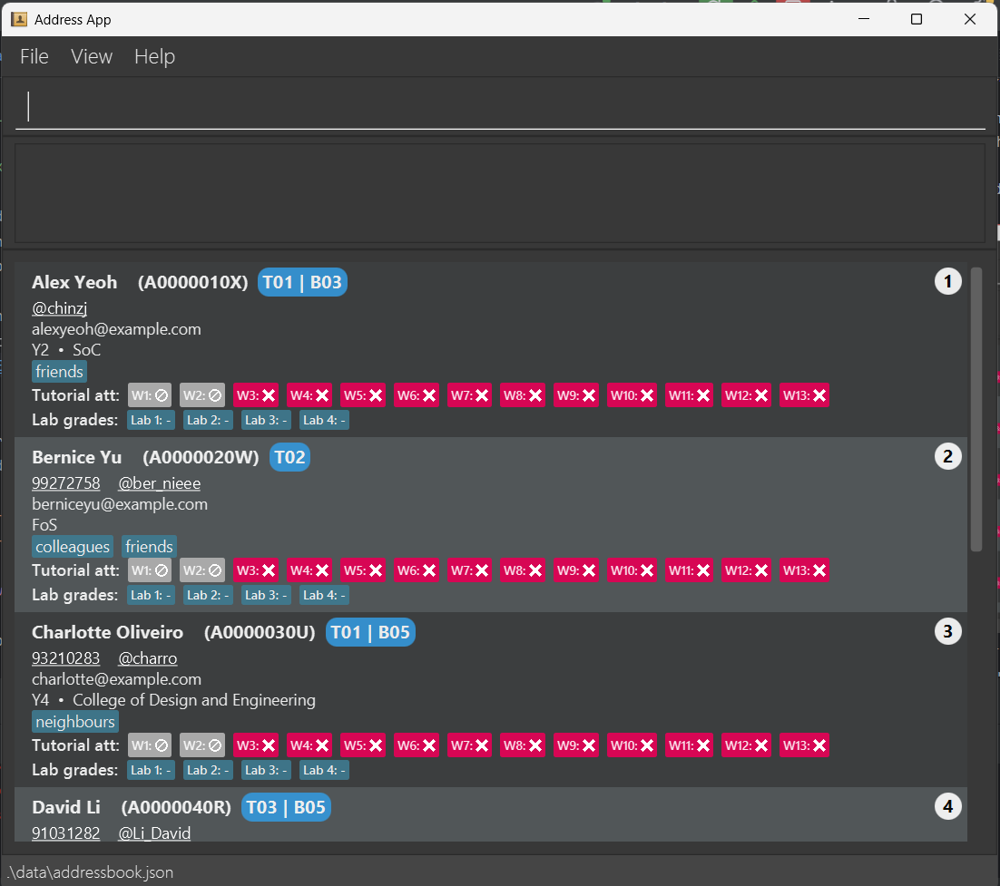

# TAssist

## Introduction
TAssist is a keyboard-driven software catered for NUS teaching assistants to streamline the management of tutorial groups.

## Features
_Coming soon._

## Documentation
* For the detailed documentation of this project, see the **[TAssist Website](https://ay2425s2-cs2103-f15-4.github.io/tp/)**.
* 
## Additional Information
* This project is based on the AddressBook-Level3 project created by the [SE-EDU initiative](https://se-education.org).
