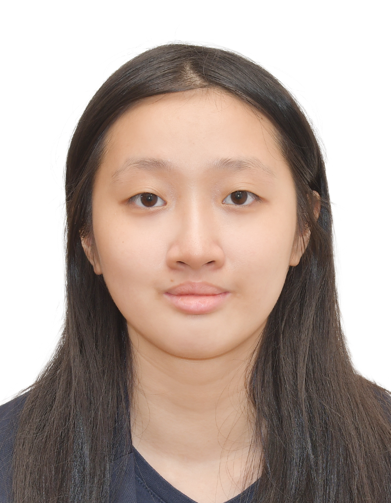

# About Us

We are a team based in the [School of Computing, National University of Singapore](http://www.comp.nus.edu.sg).

## Project team

### Chin Zhen Jie

[[homepage](https://github.com/ChinZJ)]
[[github](https://github.com/ChinZJ)]
[[PPP portfolio](team/chinzj.md)]

* Role: Deliverables and Deadlines
* Responsibilities: Ensure project deliverables are done on time and in the right format.

### Hannah Loh

[[github](http://github.com/hhlh27)]
[[PPP portfolio](team/hhlh27.md)]

* Role: Integration
* Responsibilities: In charge of versioning of the code, maintaining code repository

### Low Hsin Yi

[[github](http://github.com/hsinyilow)] [[portfolio](team/hsinyilow.md)]

* Role: Integration
* Responsibilities: In charge of versioning of the code, integrating various parts of the software to create a whole.

### Ong Wei En

[[github](http://github.com/aquaimpact)]
[[PPP portfolio](team/aquaimpact.md)]

* Role: Documentation
* Responsibilities: Quality of various project documents

### Philbert Shea

[[github](http://github.com/philbertshea)]
[[PPP portfolio](team/philbertshea.md)]

* Role: Code Quality
* Responsibilities: Looks after code quality, ensures adherence to coding standards, etc.

### Xuezhou Xu

[[homepage](https://xuxuezhou.github.io/)]
[[github](https://github.com/xuxuezhou)]
[[PPP portfolio](team/xuxuezhou.md)]

* Role: Testing
* Responsibilities: Ensures the testing of the project is done properly and on time.

