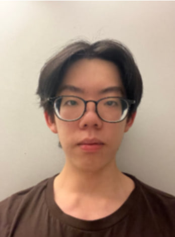
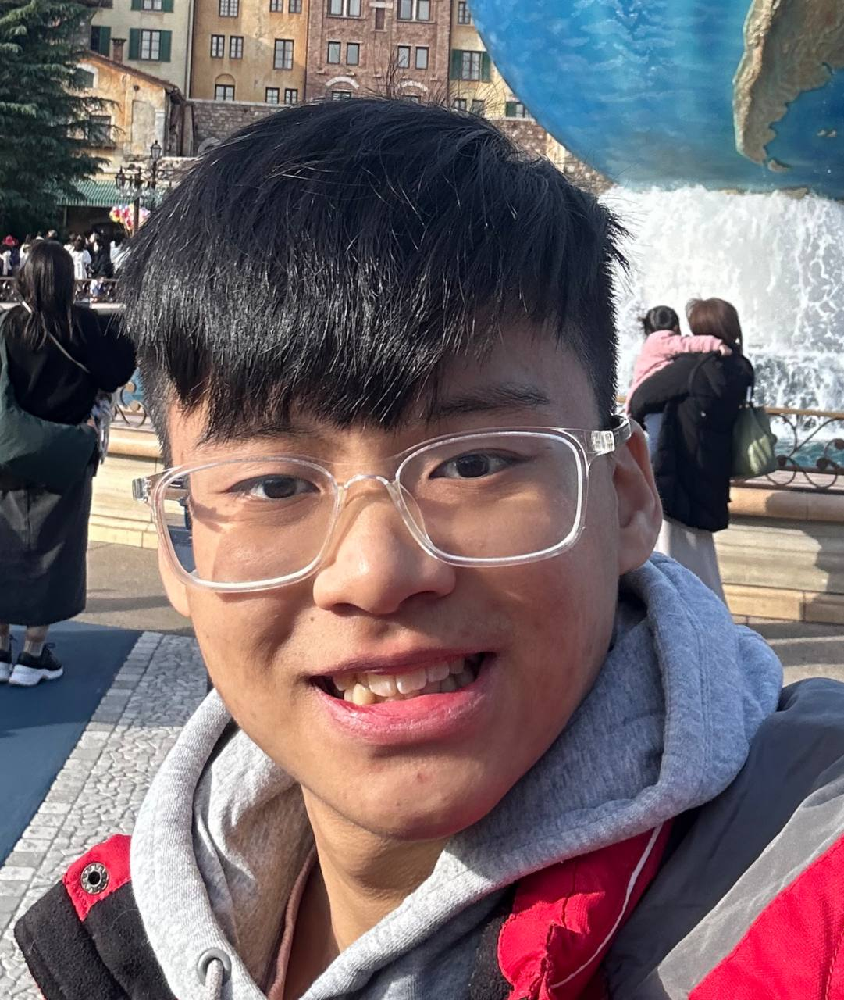
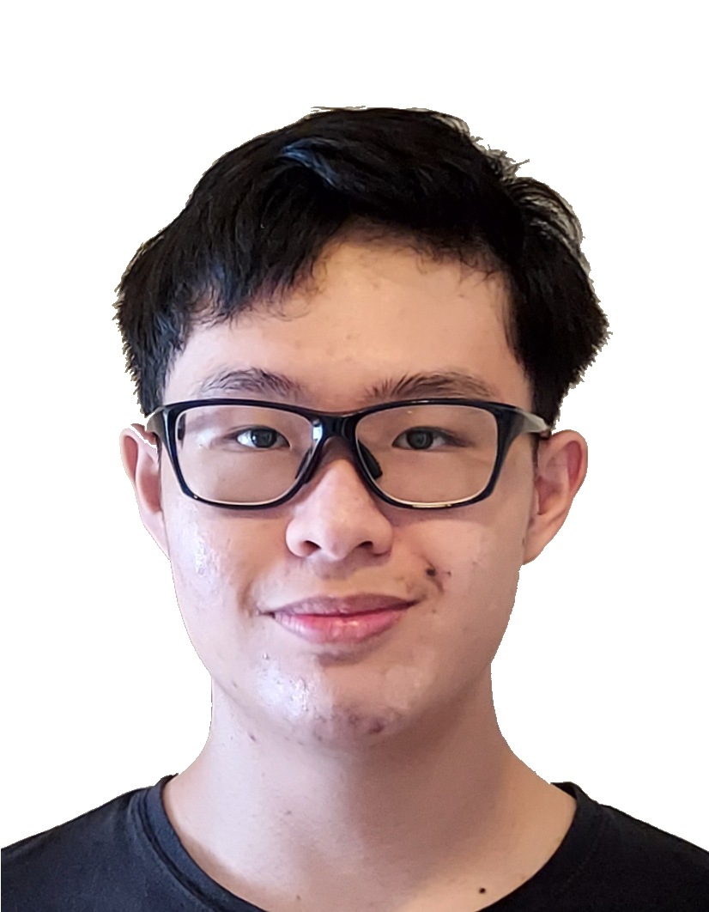

# About Us

We are a team based in the [School of Computing, National University of Singapore](http://www.comp.nus.edu.sg).

You can reach us at the email `seer[at]comp.nus.edu.sg`

## Project team

### Chin Zhen Jie

[[homepage](https://github.com/ChinZJ)]
[[github](https://github.com/ChinZJ)]
[[portfolio](team/chinzj.md)]

* Role: Deliverables and Deadlines
* Responsibilities: Ensure project deliverables are done on time and in the right format.

### Jane Doe

[[github](http://github.com/johndoe)]
[[portfolio](team/johndoe.md)]

* Role: Team Lead
* Responsibilities: UI

### Johnny Doe

[[github](http://github.com/johndoe)] [[portfolio](team/johndoe.md)]

* Role: Developer
* Responsibilities: Data

### Ong Wei En

[[github](http://github.com/aquaimpact)]
[[portfolio](team/aquaimpact.md)]

* Role: Documentation
* Responsibilities: Quality of various project documents

### Philbert Shea

[[github](http://github.com/philbertshea)]
[[portfolio](team/philbertshea.md)]

* Role: Code Quality
* Responsibilities: Looks after code quality, ensures adherence to coding standards, etc.
