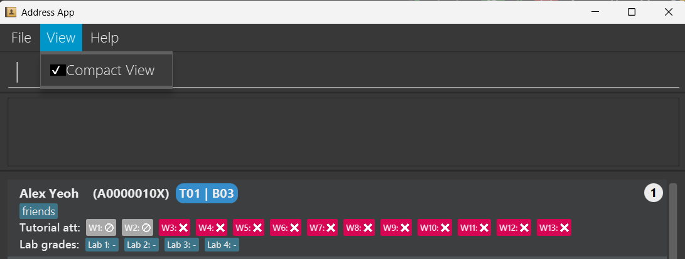
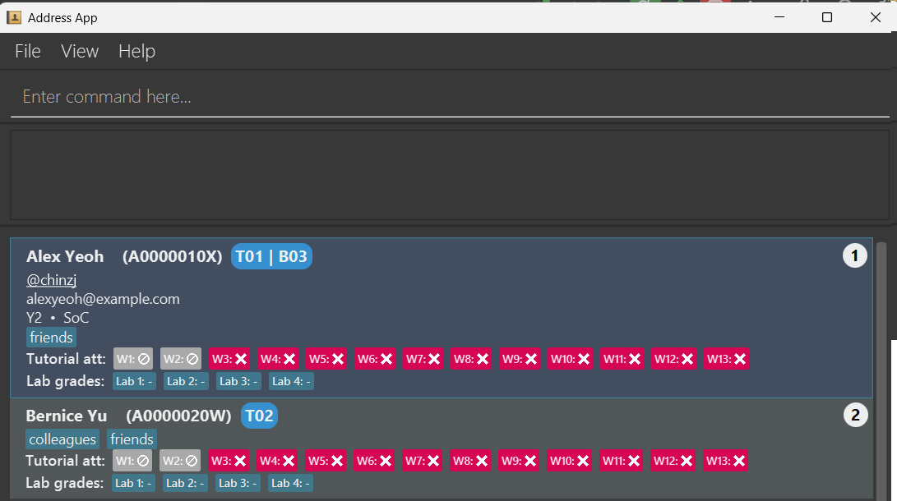

# TAssist User Guide

TAssist is a **desktop app designed for CS2106 Teaching Assistants (TAs) to manage student records, optimized for use via a Command Line Interface** (CLI) while still having the benefits of a Graphical User Interface(GUI). It provides:
* a simple, intuitive UI
* quick access to crucial student records, such as their contact, attendance and current grades
* high efficiency for fast typers
* human editable file formats for data persistence

CS2106 TAs can look forward to these attractive features that would assist their day-to-day tasks as a TA:
* Tracking a student's key school information like matriculation number, and handy information like their telegram handle
* Managing handy tags as reminders for students they may need to pay particular attention to
* Marking of tutorial attendance and updating of lab scores

<!-- * Table of Contents -->
<page-nav-print />

--------------------------------------------------------------------------------------------------------------------

## Quick start

1. Ensure you have Java `17` or above installed in your Computer. 
   **Mac users:** Ensure you have the precise JDK version prescribed [here](https://se-education.org/guides/tutorials/javaInstallationMac.html).

1. Download the latest `.jar` file from [here](https://github.com/AY2425S2-CS2103-F15-4/tp/releases/tag/v1.5).

1. Copy the file to the folder you want to use as the _home folder_ for TAssist.

1. Open a command terminal, `cd` into the folder you put the jar file in, and use the `java -jar TAssist.jar` command to run the application. 
   A GUI similar to the one below should appear in a few seconds. Note how the app contains some sample data. 
   

1. Type the command in the command box and press Enter to execute it. e.g. typing **`help`** and pressing Enter will open the help window. 
   Some example commands you can try:

   * `list` : Lists all contacts.

   * `add -n John Doe -p 98765432 -e johnd@example.com -m A0123456J -t T01` : Adds a contact named `John Doe` to TAssist.

   * `edit -i 1 -p 91234567 -e johndoe@example.com` : Edits the phone number and email address of the 1st student to be `91234567` and `johndoe@example.com` respectively.

   * `tag -a -i 1 -tag lateStudent` : Adds a tag to the 1st student with the label `lateStudent`

   * `del -i 3` : Deletes the student at index 3.

   * `att -i 3 -w 5` : Marks the student at index 3 as attended tutorial in week 5.

   * `export -f ./data/test.csv` Exports the current data as a CSV file into the path ./data/test.csv

   * `clear` : Deletes all students.

   * `exit` : Exits the app.

1. Tired of reading the user guide to understand how to use our app? Just type the command name (e.g. `edit`) into the command box to know more about how to use the command!

1. Student particulars that you would not require on a regular basis can be hidden! Simply type `toggle` and they will disappear! Alternatively click on `view` → `Compact View`!  
   

1. To show more details about a particular contact, click on the contact itself! 
   

1. Refer to the [Features](#features) below for details of each command.

--------------------------------------------------------------------------------------------------------------------

## Features

<box type="info" seamless>

**Notes about the command format:** 

* Words in `UPPER_CASE` are the parameters to be supplied by the user. 
  e.g. in `add -n NAME`, `NAME` is a parameter which can be used as `add -n John Doe`.

* For items in parentheses, at least one of them must be supplied. 
  e.g `(-p PHONE_NUMBER -tg TELEGRAM_HANDLE)` means either `-p PHONE_NUMBER` or `-tg TELEGRAM_HANDLE` or both `-p PHONE_NUMBER -tg TELEGRAM HANDLE` are accepted.
  * **Important Exception**: For the MarkAttendanceCommand, `(-i INDEX -t TUTORIAL_GROUP)` will ONLY allow EITHER `-i INDEX`
  OR `-t TUTORIAL_GROUP` as inputs, but NOT BOTH. Do take note of this particular exception.

* Items in square brackets are optional. 
  e.g `-n NAME [-tag TAG]` can be used as `-n John Doe -tag friend` or as `-n John Doe`.

* Items with `…`​ after them can be used multiple times including zero times. 
  e.g. `[-tag TAG]…​` can be used as ` ` (i.e. 0 times), `-tag friend`, `-tag friend -tag family` etc.

* Parameters can be in any order. 
  e.g. if the command specifies `-n NAME -p PHONE_NUMBER`, `-p PHONE_NUMBER -n NAME` is also acceptable.

* Extraneous parameters for commands that do not take in parameters (such as `help`, `list`, `exit` and `clear`) will be ignored. 
  e.g. if the command specifies `help 123`, it will be interpreted as `help`.

* If you are using a PDF version of this document, be careful when copying and pasting commands that span multiple lines as space characters surrounding line-breaks may be omitted when copied over to the application.
</box>

### Viewing help : `help`

Shows a message explaining how to access the help page.

Format: `help`

### Toggling view : `toggle`

Toggles the student record view to be more compact.
The following particulars of a student will be hidden if compact view is enabled where applicable: `PHONE_NUMBER`, `TELEGRAM_HANDLE`, `EMAIL`, `MATRICULATION_NUMBER`, `YEAR` and `FACULTY`.

<box type="tip" seamless>

**Tip:** `PHONE_NUMBER` AND `TELEGRAM_HANDLE` can be copied to your clipboard! Just click on it!
</box>

### Listing all students : `list`

Shows a list of all students in the address book.

Format: `list`

### Searching students: `search`

Search for students based on specific parameters. At least one parameter must be provided.

Format: `search (-n NAME) [-p PHONE_NUMBER] [-e EMAIL] [-m MATRICULATION_NUMBER] [-t TUTORIAL_GROUP] [-b LAB_GROUP] [-f FACULTY] [-y YEAR_OF_STUDY] [-tag TAG]`

* The search is case-insensitive (e.g., `john` will match `John`).
* The order of parameters does not matter.
* If multiple parameters of the same type are provided (e.g., `-f SoC -f FoS`), only the last one is used for searching.
* The search supports partial matching (e.g., `jo` will match `John`).

Parameters:
* `-n`: Search by student name
* `-p`: Search by phone number
* `-e`: Search by email address
* `-m`: Search by matriculation number
* `-t`: Search by tutorial group
* `-b`: Search by lab group
* `-f`: Search by faculty
* `-y`: Search by year of study
* `-tag`: Search by tag

Examples:
* `search -n john` returns students with names containing "john" (e.g., "John Doe", "Johnny")
* `search -f Computing` returns students from the Computing faculty
* `search -t T01` returns all students in tutorial group T01
* `search -tag lateStudent` returns students tagged with "lateStudent"

### Redo command: `redo`
Format: `redo`

Redo the last command that was executed.
Refer to **Undo Command** for the list of commands supported.

<box type="tip" seamless>

**Tip**: if you undo a command and run any other **valid** commands
(including ignored command such as `list`), you will not be able to redo
any of the old commands that you had just undo.

</box>

Example:
1. Run a command `lab -ln 1 -msc 25`
1. `undo` (undo the command `lab -ln 1 -msc 25`)
1. Here you can still redo the command, but if you run something step 4:
1. `list` or `att -i 1 -w 3`
1. You cannot redo the `lab -ln 1 -msc 25` command

### Undo command: `undo`
Format: `undo`

Undo the last command that was executed.

Supported commands:
* `add`
* `edit`
* `delete`
* `clear`
* `att`
* `lab`
* `tag`

The following commands will ignore any changes:
* `list`
* `exit`
* `help`
* `toggle`
* `search`
* `export`
* `load`

### Adding a student: `add`

Adds a student to the address book.

Format: `add -n NAME (-p PHONE_NUMBER -tg TELEGRAM_HANDLE) -e EMAIL -m MATRICULATION_NUMBER (-t TUTORIAL_GROUP -b LAB_GROUP) [-f FACULTY] [-y YEAR_OF_STUDY] [-r REMARKS] [-tag TAG]…​`

<box type="tip" seamless>

**Tip:** Matriculation numbers follow a checksum rule!
See [here](https://nusmodifications.github.io/nus-matriculation-number-calculator/) for a matriculation number calculator.

Want to manually calculate the checksum?
1. Sum up only the **last 6 numbers** within the matriculation number.
1. Divide this sum by 13 and take the remainder.
1. Use the remainder as an index (0-based!) to select a character from the sequence `YXWURNMLJHEADB`.
- `A0000000Y` has a sum of `0` and thus ends with `Y`.
- `A4000049Y` has a sum of `13` and thus also ends with `Y`.
- `A0000001X` has a sum of `1` and thus ends with `X`.
</box>

<box type="tip" seamless>

**Tip:** Only the **matriculation number** of a record makes them unique!
</box>

<box type="tip" seamless>

**Tip:** A student can have any number of tags (including 0).
Tags must be a single word consisting of alphanumeric characters only.
Tags also have a limit of 60 characters.
</box>

<box type="tip" seamless>

**Note:**
* If `TUTORIAL_GROUP` is provided as an input when adding a student, then the student is assigned
the Default Attendance List (with No Tutorial for Weeks 1 and 2, and Not Attended for Weeks 3 to 13).
* If no `TUTORIAL_GROUP` is provided as input when adding a student, then the student is assigned
a Blank Attendance List.
</box>

Examples:
* `add -n John -p 81234567 -tg @jornn -e e1234567@u.nus.edu -m A1234567X -t T02 -b B03 -f Computing -y 5 -r Likes to sing`
* `add -n Doe -tg @doe_a_deer -e e7654321@u.nus.edu -b B01 -m A7654321J`

### Editing a student : `edit`

There are 2 possible ways to edit the students in the list.

#### 1. Edit a single student

Edits an existing student in the address book.

Format: `edit -i INDEX [-n NAME] [-p PHONE_NUMBER] [-tg TELEGRAM_HANDLE] [-e EMAIL] [-m MATRICULATION_NUMBER] [-t TUTORIAL_GROUP] [-b LAB_GROUP] [-f FACULTY] [-y YEAR_OF_STUDY] [-r REMARKS]​`

* Edits the student at the specified `INDEX`. The index refers to the index number shown in the displayed student list. The index **must be a positive integer** 1, 2, 3, …​
* At least one of the optional fields must be provided.
* Existing values will be updated to the input values.
* The behaviour of the edit command depends on the field being edited:
  * For mandatory fields of a student: `-n NAME`, `-e EMAIL`, `-m MATRICULATION_NUMBER`, 
  a valid input value must be provided to replace the current value.
    * E.g. `edit -i 1 -n Alex` is valid, editing the name of student of index 1 to Alex.
    * `edit -i 1 -n 123!#$` is invalid, because 123!#$ is not a valid name.
    * `edit -i 1 -n` is invalid, because a student must have a name, which is a mandatory field.
  * There are two sets of conditional fields: Set 1: `-p PHONE_NUMBER -tg TELEGRAM_HANDLE` and
  * Set 2: `-t TUTORIAL_GROUP -b LAB_GROUP`.
These are conditional fields, whereby AT LEAST ONE or BOTH of the fields in EVERY SET must have a valid input.
    * Providing a valid input value for either or both fields will always be supported as a valid edit.
    * The validity of the edit command depends on whether the student fulfills these conditions after the edit:
      * After the edit, the student has AT LEAST a valid `PHONE_NUMBER` OR a valid `TELEGRAM_HANDLE`.
      * After the edit, the student has AT LEAST a valid `TUTORIAL_GROUP` OR a valid `LAB_GROUP`.
    * E.g. if the student of index 1 currently has a valid `PHONE_NUMBER` but no valid `TELEGRAM_HANDLE`:
      * `edit -i 1 -p 90001234` is valid, because he will still have a valid phone number after the edit.
      * `edit -i 1 -t @telehandle123` is valid, because he will have BOTH a valid phone number
      AND a valid teleHandle after the edit.
      * `edit -i 1 -p` is INVALID, because the proposed edit would make the student have NEITHER a valid phone number,
      NOR a valid teleHandle after the edit.
  * Optional fields like `FACULTY`, `YEAR` and `REMARKS` can be edited to any valid input, or empty input.

Examples:
*  `edit -i 1 -p 91234567 -e johndoe@example.com` Edits the phone number and email address of the 1st student to be `91234567` and `johndoe@example.com` respectively.
*  `edit -i 2 -n Betsy Crower` Edits the name of the 2nd student to be `Betsy Crower`.

#### 2. Edit multiple students (Batch edit)

Edits several existing students in the address book in one go.

Format: `edit -i INDEX_RANGE [-t TUTORIAL_GROUP] [-b LAB_GROUP] [-f FACULTY] [-y YEAR_OF_STUDY]`
* Edits the student at the specified `INDEX_RANGE`. The index **must be a positive integer** 1, 2, 3, …​
* At least one of the optional fields must be provided. (Only the 4 stated here can be edited. Any other fields will not be accepted.)
* Existing values will be updated to the input values.

Examples:
* `edit -i 1-3 -y 2` Edits the year of study for the 1st to 3rd students to be 2
* `edit -i 1, 4, 5 -y 2 -f SOC` Edits the year of study for the 1st, 4th and 5th students to be 2 and faculty to be SOC

<box type="info" seamless>

**Note:**
* The behaviour of editing a `TUTORIAL_GROUP` on the student's Attendance List depends on his original and updated
  status (whether he had a tutorial group before the edit, and will have one after the edit).
    * Case 1: A student originally has a valid `TUTORIAL_GROUP` (and hence a valid Attendance List),
        * Case 1.1: An edit command is given to edit his `TUTORIAL_GROUP` to another valid `TUTORIAL_GROUP`.
          Then the student's Attendance List is carried over (No change to the Attendance List).
        * Case 1.2: An edit command is given to edit his `TUTORIAL_GROUP` to an empty input.
          Provided the aforementioned restrictions on the conditional parameters are fulfilled (i.e. the student has a valid `LAB_GROUP`),
          then the student's Attendance List is cleared and replaced with the Blank Attendance List.
    * Case 2: A student originally has NO valid `TUTORIAL_GROUP` (and hence an empty Attendance List),
        * Case 2.1: An edit command is given to edit his `TUTORIAL_GROUP` to a valid `TUTORIAL_GROUP`.
          Then the student's Attendance List is set to the Default Attendance List
          (with No Tutorial for Weeks 1 and 2, and Not Attended for Weeks 3 to 13).
        * Case 2.2: An edit command is given to edit his `TUTORIAL_GROUP` to an empty input.
          Then the student's Attendance List remains as a Blank Attendance List.
</box>

### Deleting a student : `del`
Deletes the specified student from the address book.

Format: `del -i INDEX[,INDEX or RANGE]...`

Parameters:
* `-i`: Specifies the 1-based index(es) of the person(s) to delete. Accepts:
* Single index (e.g. 1)
* Multiple indices separated by commas (e.g. 1,3,5)
* Ranges using dashes (e.g. 2-4)
* Mixed usage (e.g. 1,3-5,7)

Restrictions:
* The index must be a positive non-zero integer.
* Index ranges must be valid (e.g., 2-1 is not allowed).
* The -i prefix must be provided only once. Multiple `-i` prefixes (e.g. `-i 1 -i 2`) are not allowed.

Examples:
* `del -i 2`
* Deletes the person at index 2.
* `del -i 1,3-5,7`
* Deletes persons at indices 1, 3, 4, 5, and 7.

### Clearing all entries : `clear`

Clears all entries from the address book.

Format: `clear`

### Tagging a student: `tag`

There are 3 ways to tag a student.

#### 1. Adding tags

Adds tag(s) to a student.

Format: `tag -a -i INDEX [-tag TAG_NAME]...`

* Adds tags to the student at the specified `INDEX`. The index refers to the index number shown in the displayed student list. The index **must be a positive integer** 1, 2, 3, …​
* You need to add at least 1 tag. The tag will be added on top of the current tags the student has.
* The `TAG_NAME` must be alphanumeric and have a maximum of 60 characters.
* This is purely for adding. To edit and delete tags, look at [Edit Tags](#2-editing-a-tag) and [Delete Tags](#3-deleting-tags)

Examples:
* `tag -a -i 1 -tag lateStudent` Adds a tag to the 1st student with the label `lateStudent`
* `tag -a -i 1 -tag NeedHelp -tag AbleToCompete` Adds a tag to the 1st student with the labels `NeedHelp` and `AbleToCompete`
  * The resultant tags will be sorted alphabetically.

#### 2. Editing a tag

Edits a current tag.

Format: `tag -m -i INDEX -tag OLD_TAG_NAME -tag NEW_TAG_NAME`

* Edits the tag `OLD_TAG_NAME` and replaces the tag's value with `NEW_TAG_NAME` of the student at the specified `INDEX`. The index refers to the index number shown in the displayed student list. The index **must be a positive integer** 1, 2, 3, …​
* You can only edit 1 tag at a time. The `OLD_TAG_NAME` must exist for you to edit and replace its value.
* The `OLD_TAG_NAME` and `NEW_TAG_NAME` must be alphanumeric and have a maximum of 60 characters.

Examples:
* `tag -m -i 1 -tag lastStudent -tag earlyStudent` Replaces the value of the `lateStudent` tag, of the 1st student, with `earlyStudent`
* `tag -m -i 1 -tag NeedHelp -tag CanSurvive` Replaces the value of the `NeedHelp` tag, of the 1st student, with `CanSurvive`

#### 3. Deleting tags

Removes tag(s) from a student.

Format `tag -d -i INDEX [-tag TAG_NAME]...`

* Deletes the specified tags from the student at the specified `INDEX`. The index refers to the index number shown in the displayed student list. The index **must be a positive integer** 1, 2, 3, …​
* You must specify at least 1 tag when using this command. `TAG_NAME` is case sensitive and will only delete exact matches.
* The `TAG_NAME` must be alphanumeric and have a maximum of 60 characters.

Examples:
* `tag -d -i 1 -tag earlyStudent` Deletes the tag `earlyStudent` from student 1
* `tag -d -i 1 -tag tag1 -tag tag2` Deletes the tags `tag1` and `tag2` from student 1

### Marks attendance: `att`

Marks the attendance of an individual student, or a tutorial group.

<box type="tip" seamless>

**Tip**: With the new release, you can now mark the attendance of multiple students or tutorial groups.

</box>

<box type="info" seamless>

**Note**: This will be a long documentation, because of the multiple restrictions imposed
on the marking of attendance. However, the brief summary is here:

Format: `att (-i INDEX -t TUTORIAL_GROUP) -w WEEK [-mc] [-u] [-nt]`
* Conditional parameters: EITHER `-i INDEX` OR `-t TUTORIAL_GROUP`, ONLY,
where `INDEX` is a positive integer from 1 to n inclusive, n being the number of students on the list 
(if n=0, you'll have to add one first) and `TUTORIAL_GROUP` is a string of two or three characters, whereby the first
character is `T` or `t`, and the second (and optional third) character(s) is/are digits from 0 to 9 inclusive, e.g. `T01`.
* Mandatory parameter: `-w WEEK`, where `WEEK` is a positive integer from 1 to 13 inclusive.
* Optional parameters: EITHER ONE OF `-mc` (mark on MC), `-u` (mark as not attended), OR `-nt` (mark as no tutorial) ONLY.
* Note there are additional restrictions. For example, you cannot mark attendance for students with no tutorial group.
  (Use the edit command to add a tutorial group for the student first).`-nt` also applies to commands with `-t` ONLY, not `-i`.
  (It does not make sense to mark one student as having no tutorial - this function is for tutorials being cancelled, so
the whole tutorial group should be affected).

This note is offered here as a **Brief Summary ONLY**. There are additional restrictions as outlined below in the
full documentation. If you encounter issues, do check whether that corresponding command is valid first, using
the documentation below.
</box>

Format: `att (-i INDEX -t TUTORIAL_GROUP) -w WEEK [-mc] [-u] [-nt]`

* Conditional parameters: EITHER `-i INDEX` OR `-t TUTORIAL_GROUP`, ONLY.
  * Not accepted: NEITHER of the flags provided, or BOTH flags provided together.
* Mandatory parameter: `-w WEEK`.
  * Not accepted: MISSING week flag
* Optional parameters: EITHER ONE OF `-mc`, `-u`, OR `-nt`
  * Not accepted: TWO or more of the above flags.

Note the following restrictions on the provided inputs.
* `INDEX` must be a **positive integer**, from 1 to n inclusive, where n is the number of students in the list.
    * In the case whereby n = 0, i.e. there are no students in the list, then you will need to minimally add one student
      with a valid tutorial group into the list, in order to use the Mark Attendance Command.
* `TUTORIAL_GROUP` must be a **String of two OR three characters**.
    * The first character must be a capital 'T' or small letter 't'.
    * The second (and optional third) character(s) must be numerical digit(s) from 0 to 9 inclusive.
    * Valid `TUTORIAL_GROUP` inputs include `T1` (which is equivalent to `T01`), `T02`, `t10`.
    * Besides, note the additional restriction that a `TUTORIAL_GROUP` provided must be a tutorial group attribute
  of at least ONE student in the list. For example, if `T99` is provided, but no students in the list are of
  tutorial group T99, then this is not a valid tutorial group that matches to any student, given the current list of students.
* Note that a valid index and tutorial group does NOT necessarily mean the command will be valid. 
There are other restrictions to fulfill, as illustrated by the parameters above and the additional restrictions below.

Additional restrictions apply to the marking attendance command.
  * Commands using the `-i` flag have additional restrictions.
    1. `-nt` flag cannot be used on a command with the `-i` flag. This means you cannot mark an individual
    as having No Tutorial.
       * If Alex of index 1 didn't attend Week 5 tutorial, mark him as Not Attended (or Unattended) using `att -i -w 5 -u`.
       * If Alex's tutorial group T01 falls on a public holiday, such that the Week 5 tutorial gets cancelled,
       mark the whole tutorial group as No Tutorial. Use the command `att -t T01 -w 5 -nt`.
    2. If the student specified by the `INDEX` has No Tutorial in the given week, the command is invalid.
    This means you cannot mark an individual to any attendance status, if he currently has No Tutorial.
       * Assume Alex of tutorial group T01 originally had their tutorial cancelled due to the public holiday.
       Now, the profs announce a make-up tutorial for T01 that everyone must attend (like normal tutorials).
           * First, mark the whole tutorial group as Not Attended, using `att -t T01 -w 5 -u`.
           * On the day of the makeup tutorial, you find that Alex (index 1) attended.
           * Then, mark Alex as having attended the tutorial, `att -i 1 -w 5`.
    3. If the student has a Blank Attendance List, any command on the student will be invalid.
       * Alex of index 1 has no `TUTORIAL_GROUP` (e.g. he is not in your tutorial group).
       Then it doesn't make sense to mark his attendance for any week.
       * If you realise Alex is actually in tutorial group T01, use the `edit` command to edit
       his `TUTORIAL_GROUP` to T01 first. Then you can use the mark attendance command on him.

Assuming the restrictions are satisfied,
* Marks the attendance of a student (if `-i INDEX` is provided)
  OR all students in a tutorial group (if `-t TUTORIAL_GROUP` is provided).
* The new attendance status is ATTENDED by default. However:
    * If `-mc` is provided, the new attendance status is ON MC.
    * If `-u` is provided, the new attendance status is NOT ATTENDED.
    * If `-nt` is provided, the new attendance status is NO TUTORIAL.

<box type="info" seamless>

**Note**: You can now mark the attendance of multiple students and tutorial groups as valid.

* `INDEX` now accepts a comma (`,`) or hyphen (`-`) separated range of indexes.
  * Every index listed, or implied in a provided range, must be a valid index.
  That is, every index provided must be a **positive integer** , from 1 to n inclusive, 
  where n is the number of students in the full list of students.

  * Besides, if a hyphen-separated range is provided, it must be of the format `a-b`, such that `a <= b`.
  This means that the hyphen-separated range must be **non-decreasing**.
  * **NO SPACES** are allowed in the provided index range.
  * Valid inputs: `1,2,3` (indexes 1, 2 and 3); `1-3` (indexes 1 to 3 inclusive); `1,2-3` (indexes 1, and indexes 2 to 3 inclusive)
  * Invalid inputs: `-1-3` (indexes -1 and 0 implied by the range are invalid); `1, 2` (space not allowed)

* `TUTORIAL_GROUP` now accepts a comma or hyphen-separated list of tutorial groups.
  * Every tutorial group listed, or implied in a provided range, must be a valid tutorial group.
  That is, every tutorial group provided must be a String of two or three characters.
    * The first character must be a capital 'T' or small letter 't'.
    * The second (and optional third) character must be numerical digits from 0 to 9 inclusive.
    * Besides, note the additional restriction that a `TUTORIAL_GROUP` provided must be a tutorial group attribute
      of at least ONE student in the list. For example, if `T99` is provided, but no students in the list are of
      tutorial group T99, then this is not a valid tutorial group that can be matched to any student, given the current list of students.

  * Besides, if a hyphen-separated range is provided, it must be of the format `Tab-Tcd` (`T` can be replaced with `t`)
  such that `a`, `b`, `c` and `d` are numerical digits from 0 to 9 inclusive, and `ab <= cd` in decimal format.
  (more accurately, `a * 10 + b` is smaller than or equal to `c * 10 + d`)
  This means that the hyphen-separated range must be **non-decreasing**.
  * **NO SPACES** are allowed in the provided index range.
  * Valid inputs: `T01,T02,T03` (tutorial groups T01, T02 and T03); `1-3` (tutorial groups T01 to T03 inclusive); 
  `T01,t02-t03` (tutorial groups T01, and tutorial groups T02 to T03 inclusive)
  * Invalid inputs: `1-3` (invalid format of tutorial groups); `T05-T01` (descending range of tutorial groups)

- However, do note that if you are using the `-i` flag, to mark attendance of students by index,
  the restrictions aforementioned apply to EVERY student listed.
  - For example, you want to mark students of index 1 to 10 (inclusive) as attended for week 3.
  - You realise that student 3 has no tutorial group, and students 4,5 are in tutorial group T03,
  and group T03's tutorial has been cancelled due to the clashing holiday. They are currently
  marked as No Tutorial for week 3, which is appropriate given their tutorial is cancelled.
  - `att -i 1-10 -w 3` gives you an error because students 3, 4, 5 do not fulfill the restrictions. The error message 
  will show the first student that does not fulfill the restrictions within the range of indexes provided.
  - You will need to mark attendance for the other people using `att -i 1-2,6-10 -w 3`.
  </box>

Examples:
* `att -i 1 -w 3` marks the first student as attended Tutorial Week 3.
* `att -i 2 -w 10 -mc` marks the second student as on MC for Tutorial Week 10.
* `att -t T01 -w 1 -nt` marks the whole tutorial group T01 as No Tutorial for Tutorial Week 1.
  * This means each student in tutorial group T01 has his attendance updated to No Tutorial.
* `att -i 1-5 -w 3` marks the students of indexes 1 to 5 (inclusive) of week 3 as Attended.

### Updating lab scores: `lab`
Updates the lab score for the specified student, or update the maximum score for the specified lab.

Format: `lab (-i [INDEX]) -ln [LAB_NUMBER] -sc [NEW_SCORE] -msc [MAXIMUM_LAB_SCORE]`

3 ways of using this command
1. Update lab score: Updates the student `INDEX` lab `LAB_NUMBER` score to be `NEW_SCORE`.
    * Command format: `lab -i [INDEX] -ln [LAB_NUMBER] -sc [NEW_SCORE]`.
2. Update maximum lab score: Updates the lab `LAB_NUMBER` maximum score to be `NEW_SCORE`.
    * Command format: `lab (-i [INDEX]) -ln [LAB_NUMBER] -msc [NEW_SCORE]`.
    * Note that the `-i` flag is optional here as it will be ignored.
3. Update both lab score and max lab score: Updates the student `INDEX` lab `LAB_NUMBER` score to be `NEW_SCORE_1`
   and at the same time update lab `LAB_NUMBER` maximum score to be `NEW_SCORE_2`.
    * Command format: `lab -i [INDEX] -ln [LAB_NUMBER] -sc [NEW_SCORE_1] -msc [NEW_SCORE_2]`.

Note that for all cases, the flags do not need to be in this specific order.

### Load Data : `load`

Imports student data from an existing `.csv` or `.json` file.

Format: `load -f FILE_NAME -ext FILE_EXTENSION`

* The `FILE_NAME` should not include a file extension or path. It must refer to a file in the `/data` folder, e.g. `userdata`.
* The `FILE_NAME` must contain only alphanumeric characters, dashes, or underscores (e.g., `my-data_123`).
* Unlike the `export` command, the `load` command can only access files directly in the `/data` folder of the application. Full or relative paths with special characters (like `~` or `/`) are not supported.
* The `FILE_EXTENSION` must be either `csv` or `json`.
* The file must follow TAssist's expected format. Invalid or malformed data will be rejected with a warning.
* Duplicate records will be skipped with error messages shown.
* For CSV files, formatting errors (such as missing commas or incorrect number of fields) may cause the entire file to fail loading, with an appropriate error message displayed.

Examples:
* `load -f userdata -ext csv` loads a CSV file named `userdata.csv` located in the `/data` folder.
* `load -f students -ext json` loads a JSON file named `students.json` in the `/data` folder.

<box type="info" seamless>

What is the `attendances` attribute in the CSV or JSON file?

We use either a length-0 Empty String `""` or a length-13 String of 13 digits from 0 to 3 inclusive to denote a student's attendance records.
* If a student has no `TUTORIAL_GROUP`, he MUST have an Empty String, as his `attendances` or `attendanceList` attribute.
* If a student has a valid `TUTORIAL_GROUP`, he MUST have a length-13 String of 13 digits from 0 to 3 inclusive, as his `attendances` attribute.
* This means that in the CSV or JSON file loaded, the ONLY VALID combinations of `tutGroup` and `attendances` are:
  1. `tutGroup` = `""` AND `attendances` = `""`
  2. `tutGroup` = some valid tutorial group e.g. `T01` 
  AND `attendances` = some valid length-13 string of 13 digits from 0 to 3 inclusive, e.g. `3300000000000`.
* If AT LEAST ONE of the students' data provided in the JSON or CSV file do not follow the above combinations,
the file will be deemed as CORRUPTED, and the app will start from an Empty AddressBook.
* Do note you will need to adapt this to the JSON or CSV formatting just like other attributes.

A length-0 Empty String `""` represents a Blank Attendance List.
A length-13 String of 13 digits from 0 to 3 inclusive represents an Attendance List that tracks attendances for weeks 1 to 13 (inclusive).
* The `i`th digit in this string (1-indexed, counting from the left) represents the attendance status of the student in week `i`.
* The digit `0` represents attendance status of NOT ATTENDED, digit `1` represents attendance status of ATTENDED,
digit `2` represents attendance status of ON MC, digit `3` represents attendance status of NO TUTORIAL.
  * For example, if `attendances` is a string `"3300011111222"`, the student has had NO TUTORIAL for weeks 1 and 2,
  NOT ATTENDED tutorials for weeks 3, 4 and 5, ATTENDED tutorials for weeks 6, 7, 8, 9, 10, and ON MC for weeks 11, 12 and 13.
* If AT LEAST ONE of the students' data provided in the JSON or CSV file do not follow the above restrictions,
e.g. one student has `attendances` being a String of an invalid length (not 0 and not 13) like `"00000"`,
or a String of valid length but having invalid characters (e.g. digits 4 to 9 inclusive, alphabet, symbols)
like `"0000011111334"`, the file will be CORRUPTED and the app will start from an Empty AddressBook.

</box>

### Export Data : `export`

Exports all the student data as CSV or JSON file.
There are 2 ways to export data

#### 1. Using the CLI:

Format: `export -f FILE_PATH`

* Exports the data to the `FILE_PATH` specified in this command.
* The `FILE_PATH` can either be relative to the current application OR be a full file path.
* The FILE_PATH must end either in a `<filename>.csv` or `<filename>.json`

Examples:
* `export -f ./data/test.csv` Exports the current data as a CSV file into the path ./data/test.csv
* `export -f /Users/user_name/Desktop/data.json` Exports the current data as a JSON file into the Desktop under data.json

#### 2. Using the UI:

1. On the toolbar, go to Files > Export Data...
2. Select the file type (either JSON or CSV)
3. Select where you want to save your file at

### Exiting the program : `exit`

Exits the program.

Format: `exit`

### Saving the data

TAssist data is saved in the hard disk automatically after any command that changes the data. There is no need to save manually.

### Editing the data file

TAssist data is saved automatically as a JSON file `[JAR file location]/data/addressbook.json`. Advanced users are welcome to update data directly by editing that data file.

<box type="warning" seamless>

**Caution:**
If your changes to the data file make its format invalid, TAssist will discard all data and start with an empty data file at the next run.  Hence, it is recommended to take a backup of the file before editing it. 
Furthermore, certain edits can cause the TAssist to behave in unexpected ways (e.g., if a value entered is outside the acceptable range). Therefore, edit the data file only if you are confident that you can update it correctly.

</box>

--------------------------------------------------------------------------------------------------------------------

## FAQ

**Q**: How do I transfer my data to another Computer? 
**A**: Install the app on the other computer and overwrite the empty data file it creates with the file that contains the data of your previous AddressBook home folder.

--------------------------------------------------------------------------------------------------------------------

## Known issues

1. **When using multiple screens**, if you move the application to a secondary screen, and later switch to using only the primary screen, the GUI will open off-screen. The remedy is to delete the `preferences.json` file created by the application before running the application again.
2. **If you minimize the Help Window** and then run the `help` command (or use the `Help` menu, or the keyboard shortcut `F1`) again, the original Help Window will remain minimized, and no new Help Window will appear. The remedy is to manually restore the minimized Help Window.

--------------------------------------------------------------------------------------------------------------------

## Command summary

Action     | Format, Examples
-----------|----------------------------------------------------------------------------------------------------------------------------------------------------------------------
**Help**   | `help`
**Toggle** | `toggle`
**List**   | `list`
**Search** | `search (-n NAME) [-p PHONE_NUMBER] [-e EMAIL] [-m MATRICULATION_NUMBER] [-t TUTORIAL_GROUP] [-b LAB_GROUP] [-f FACULTY] [-y YEAR_OF_STUDY] [-tag TAG]`
**Redo**   | `redo`
**Undo**   | `undo`
**Add**    | `add -n NAME (-p PHONE_NUMBER -tg TELEGRAM_HANDLE) -e EMAIL -m MATRICULATION_NUMBER (-t TUTORIAL_GROUP -b LAB_GROUP) [-f FACULTY] [-y YEAR_OF_STUDY] [-r REMARKS] [-tag TAG]…​`   e.g., `add -n John -p 81234567 -tg @jornn -e e1234567@u.nus.edu -m A1234567X -t T02 -b B03 -f Computing -y 5 -r Likes to sing`
**Edit**   | `edit -i INDEX [-n NAME] [-p PHONE_NUMBER] [-tg TELEGRAM_HANDLE] [-e EMAIL] [-m MATRICULATION_NUMBER] [-t TUTORIAL_GROUP] [-b LAB_GROUP] [-f FACULTY] [-y YEAR_OF_STUDY] [-r REMARKS]`  e.g.,`edit -i 2 -n James Lee -e jameslee@example.com`
**Delete** | `del -i INDEX [,INDEX or RANGE]...`  e.g., `del -i 3`
**Clear**  | `clear`
**Tag**    | Add: `tag -a -i INDEX [-tag TAG_NAME]...`  e.g., `tag -a -i 1 -tag lateStudent`   Edit: `tag -m -i INDEX -tag OLD_TAG_NAME -tag NEW_TAG_NAME`  e.g., `tag -m -i 1 -tag lastStudent -tag earlyStudent`   Delete: `tag -d -i INDEX [-tag TAG_NAME]...`  e.g., `tag -d -i 1 -tag earlyStudent`
**Mark Attendance**   | `att (-i INDEX -t TUTORIAL GROUP) -w WEEK [-mc] [-u] [-nt]`
**Lab Score** | `lab (-i [INDEX]) -ln [LAB_NUMBER] -sc [NEW_SCORE] -msc [MAXIMUM_LAB_SCORE]`   e.g., `lab -i 1 -ln 1 -sc 20`
**Load Data** | `load -f FILE_NAME -ext FILE_EXTENSION`  e.g., `load -f userdata -ext csv`
**Export Data** | `export -f FILE_PATH`  e.g., `export -f ./data/test.csv`
